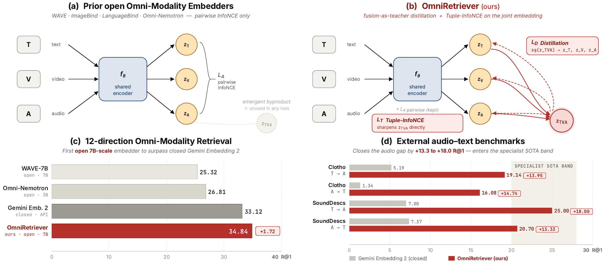
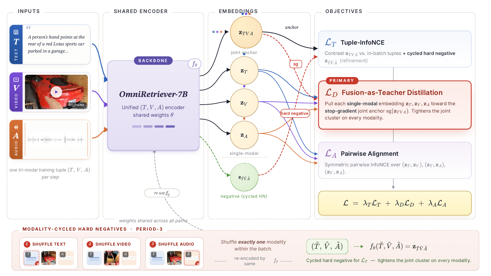

# OmniRetriever

**Any-to-Any Audio-Video-Text Retrieval via Fusion-as-Teacher Distillation.**

<p align="center">
  
</p>

> Every unified audio-video-text (AVT) encoder produces, on its forward pass,
> a joint `(T, V, A)` embedding `z_TVA` that is its strongest cross-modally
> grounded vector. Yet pairwise InfoNCE never uses `z_TVA` — neither as a
> supervision target nor as a teacher of its single-modal sub-encoders.
> OmniRetriever identifies this as a structural blind spot of every open AVT
> embedder to date and proposes **fusion-as-teacher distillation** to fix it.

This repository contains the inference and evaluation code that accompanies
the paper. The released artifacts live on the Hugging Face Hub:

| Artifact | Hub ID | Status |
| --- | --- | --- |
| OmniRetriever-7B LoRA adapter | [`YunzeLiu/OmniRetriever-7B`](https://huggingface.co/YunzeLiu/OmniRetriever-7B) | **Released** |
| OmniRetriever-Bench (3,782 AVT triples) | `<TBD>/OmniRetriever-Bench` | **Coming soon** |

---

## Headline numbers (paper Table 1)

| Model | AVG-single | AVG-dual | **AVG-all R@1** |
| --- | ---: | ---: | ---: |
| WAVE-7B (frozen)           | 19.27 | 31.37 | 25.32 |
| Omni-Embed-Nemotron (open) | 21.79 | 31.84 | 26.81 |
| Gemini Embedding 2 (closed)| 25.44 | 40.80 | 33.12 |
| **OmniRetriever-7B (ours)**| **28.63** | **41.05** | **34.84** |

### Audio benchmarks (paper Table 2)

| Model | Clotho T→A | Clotho A→T | SoundDescs T→A | SoundDescs A→T |
| --- | ---: | ---: | ---: | ---: |
| Omni-Embed-Nemotron (open) | 6.4 | 3.5 | 6.4 | 4.8 |
| Gemini Embedding 2 (closed)| 5.2 | 1.3 | 7.0 | 7.4 |
| **OmniRetriever-7B (ours)**| **19.1** | **16.1** | **25.0** | **20.7** |

OmniRetriever beats Gemini Embedding 2 by **+13.3 to +18.0 R@1** on every
audio-text direction and enters the audio-text specialist SOTA band on
Clotho T→A.

### Video benchmarks (paper Table 3)

| Model | MSR-VTT T→V | MSVD T→V | DiDeMo T→V | VATEX T→V |
| --- | ---: | ---: | ---: | ---: |
| Omni-Embed-Nemotron (open) | 35.8 | 55.8 | 41.9 | 47.5 |
| Gemini Embedding 2 (closed)| **53.9** | **77.1** | **55.6** | **69.4** |
| **OmniRetriever-7B (ours)**| 47.9 | 65.6 | 45.1 | 58.7 |

---

## Quick start

### 0. Prerequisites

* Linux + Python ≥ 3.10, CUDA 12.1+
* One GPU with ≥ 24 GB memory (any A100/H100)
* `ffmpeg` ≥ 4.4 on the system path

### 1. Install

```bash
git clone <repo-url> omniretriever
cd omniretriever
python -m venv .venv && source .venv/bin/activate
pip install --upgrade pip
pip install -r requirements.txt
```

The package itself is not pip-installable; the `scripts/` wrappers set
`PYTHONPATH=src` for you, or you can do it yourself:

```bash
export PYTHONPATH=$PWD/src:$PYTHONPATH
python -m omniretriever.cli extract  --help
python -m omniretriever.cli evaluate --help
```

### 2. Pull the WAVE-7B backbone

The released adapter is a LoRA on top of the public WAVE-7B backbone.
Download the backbone and the BEATs audio-encoder checkpoint from the
upstream WAVE release, then point `WAVE_HOME` at the directory containing
them:

```bash
export WAVE_HOME=/path/to/wave-7b-root
```

Expected layout:

```
$WAVE_HOME/
├── WAVE-7B/                                              ← Hugging-Face layout
│   ├── config.json
│   ├── model-00001-of-0000N.safetensors
│   └── ...
└── BEATs_iter3_plus_AS2M_finetuned_on_AS2M_cpt2.pt       ← BEATs audio encoder
```

### 3. Pull the OmniRetriever-7B adapter and the benchmark

```bash
huggingface-cli download YunzeLiu/OmniRetriever-7B    --local-dir adapters/omniretriever-7b
huggingface-cli download <TBD>/OmniRetriever-Bench --repo-type dataset \
    --local-dir benchmark
```

(Replace `<TBD>/...` with the actual Hub IDs once published.)

### 4. Extract embeddings on OmniRetriever-Bench

```bash
bash scripts/extract_embeddings.sh \
    benchmark/manifests/omniretriever_bench.jsonl \
    output/embeddings/omniretriever_bench.npz
```

The script loads `WAVE-7B` from `$WAVE_HOME`, applies the downloaded LoRA
adapter, iterates the manifest, and writes one `text` and one `av` embedding
per record into a `.npz` file. Expected runtime on a single H100:
**≈ 30 min** for the full 3,782 triples (bf16, batch 1).

### 5. Score

```bash
bash scripts/evaluate.sh output/embeddings/omniretriever_bench.npz
```

Reports Recall@1/5/10, NDCG@10, MRR, and median rank per direction. To
reproduce the **AVG-all 34.84** headline number, run the same pipeline on
each of the 12 directions; see [`docs/evaluation.md`](docs/evaluation.md)
for the per-direction recipe and [`docs/benchmark.md`](docs/benchmark.md)
for the direction convention.

---

## Python API

```python
from omniretriever import OmniRetriever, recall_at_k, ndcg_at_10

model = OmniRetriever.from_pretrained(
    base_model=f"{WAVE_HOME}/WAVE-7B",
    adapter="YunzeLiu/OmniRetriever-7B",       # HF Hub ID or local path
    dtype="bfloat16",
)

z_text  = model.encode_text("a dog barking in the rain")
z_video = model.encode_video("benchmark/videos/0001.mp4")
z_audio = model.encode_audio("benchmark/videos/0001.mp4")     # decodes audio track
z_av    = model.encode_av("benchmark/videos/0001.mp4")        # both streams

# All embeddings are L2-normalised; cosine similarity is just a dot product.
print(float(z_text @ z_av.T))
```

For benchmark-style batch scoring:

```python
from omniretriever.evaluation import score_benchmark

results = score_benchmark("output/embeddings/omniretriever_bench.npz")
print(results["t2m"]["R@1"], results["m2t"]["R@1"])
```

---

## Repository layout

```
omniretriever/
├── README.md                       ← this file
├── requirements.txt
│
├── src/omniretriever/              ← Python package
│   ├── __init__.py                 ← top-level re-exports
│   ├── cli.py                      ← `python -m omniretriever.cli {extract,evaluate}`
│   ├── models/
│   │   ├── loader.py               ← OmniRetriever.from_pretrained
│   │   └── wave.py                 ← WAVE-7B backbone loader
│   ├── data/media.py               ← video frame + audio waveform loaders
│   ├── inference/encode.py         ← encode_{text,video,audio,av}
│   └── evaluation/{metrics,score}.py
│
├── scripts/
│   ├── extract_embeddings.sh
│   └── evaluate.sh
│
├── docs/
│   ├── installation.md
│   ├── evaluation.md
│   └── benchmark.md
│
├── training/                       ← training framework (see training/README.md)
│   ├── train.sh                    ← canonical launcher (paper recipe)
│   ├── qwenvl/                     ← Qwen2.5-Omni / WAVE fork + L_A / L_D / L_T
│   ├── configs/ds_zero0.json
│   └── third-party-licenses/
│
└── assets/figures/                 ← README / docs figures
```

Model weights and the benchmark live on the Hugging Face Hub
(see the table at the top); they are **not** vendored into the repo.

---

## Method in one minute

<p align="center">
  
</p>

OmniRetriever optimises three losses on top of WAVE-7B:

| Symbol | What it does |
| --- | --- |
| `L_A` | Standard pairwise InfoNCE between every modality pair (T-V, T-A, V-A). Kept as a stabiliser. |
| `L_D` | **Fusion-as-teacher distillation** (the paper's main contribution). A stop-gradient copy of the joint `z_TVA` produced on the forward pass becomes a *teacher* for every single-modal sub-encoder. Teacher and students share the same backbone, so the audio sub-encoder inherits text–video neighbours that no unimodal teacher can supply. |
| `L_T` | **Tuple-InfoNCE refinement.** Supervises `z_TVA` directly with *modality-cycled* hard negatives. The shuffled slot cycles deterministically through `{T, V, A}` so every modality remains discriminative inside the joint vector. |

Final objective: `L_A + L_D + L_T` with uniform weights.

### Training

The full training framework is in [`training/`](training/). To reproduce
the released LoRA on 4 × H100:

```bash
WAVE_PATH=/path/to/WAVE-7B \
BEATS_PATH=/path/to/BEATs.pt \
DATA_PATH=/path/to/your_avt_manifest.jsonl \
bash training/train.sh
```

See [`training/README.md`](training/README.md) for the full recipe,
ablation switches, and data-manifest schema.

---

## Citation

```bibtex
@article{liu2026omniretriever,
  title   = {OmniRetriever: Any-to-Any Audio-Video-Text Retrieval via Fusion-as-Teacher Distillation},
  author  = {Liu, Yunze and Wu, Chi-Hao and Zhou, Enmin and Shen, Junxiao},
  journal = {arXiv preprint},
  year    = {2026}
}
```

---

## License

Code, model weights, and benchmark are released under **Apache-2.0**.

---

## Acknowledgements

OmniRetriever builds on the WAVE-7B backbone (Qwen2.5-Omni + BEATs).
