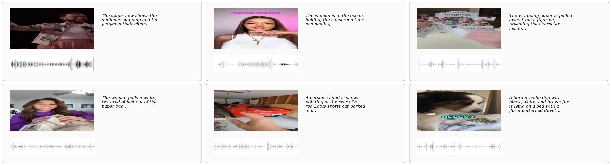

# OmniRetriever-Bench

3,782 held-out audio-video-text triples evaluated across 12 retrieval
directions on a shared gallery. Distributed on the Hugging Face Hub at
`YunzeLiu/OmniRetriever-Bench`:

```bash
huggingface-cli download YunzeLiu/OmniRetriever-Bench --repo-type dataset \
    --local-dir benchmark
```

<p align="center">
  
</p>

## Layout

```
benchmark/
├── manifests/
│   ├── omniretriever_bench.jsonl   ← 3,782 records {id, text, video, audio}
│   └── by_direction/               ← 12 per-direction manifests (optional)
├── annotations/
│   └── omniretriever_bench_gt.json
└── videos/                         ← 3,782 .mp4 files (audio muxed in)
```

## Direction conventions

Lowercase letters for single modalities, concatenated for joint streams:

| Symbol | Meaning |
| --- | --- |
| `t` | text caption |
| `v` | video (visual stream only) |
| `a` | audio (audio stream only) |
| `av` | video + audio jointly |
| `tv` | text + video jointly |
| `at` | audio + text jointly |

A direction is `q2g`. The 12 directions:

```
t2v, v2t, t2a, a2t, v2a, a2v               ← 6 single-modal
t2av, av2t, a2tv, tv2a, v2at, at2v         ← 6 dual-modal
```

## Per-direction scoring

A single extraction over the canonical manifest yields four embeddings
per record (`text`, `video`, `audio`, `av`). Any direction is then a pair
of slices:

```python
import numpy as np
blob = np.load("output/embeddings/omniretriever_bench.npz")

ids = sorted({k.split("__")[0] for k in blob.files})
def stack(mod): return np.stack([blob[f"{i}__{mod}"] for i in ids])

# Example: text -> audio+video
queries = stack("text")
gallery = stack("av")
sim = queries @ gallery.T          # embeddings are L2-normalised
```

Score with `omniretriever.evaluation.metrics.all_metrics(sim)`.

## Stats

| Property | Value |
| --- | ---: |
| Held-out triples | 3,782 |
| Median clip duration | 2.16 s |
| p99 clip duration | 16.17 s |
| Author audit κ (10 % sample) | 0.78 |
